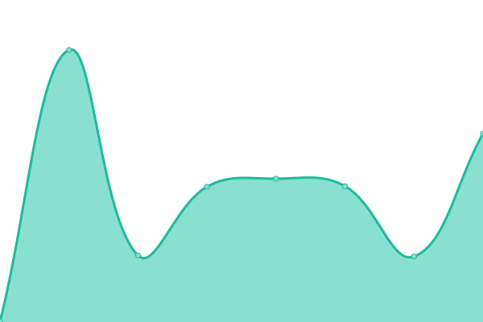

# [📈 Live Status](https://status.ethanhs.me): <!--live status--> **🟧 Partial outage**

This repository contains the open-source uptime monitor and status page for [Ethan Smith](https://ethanhs.me), powered by [Upptime](https://github.com/upptime/upptime).

With [Upptime](https://upptime.js.org), you can get your own unlimited and free uptime monitor and status page, powered entirely by a GitHub repository. We use [Issues](https://github.com/ethanhs/upptime/issues) as incident reports, [Actions](https://github.com/ethanhs/upptime/actions) as uptime monitors, and [Pages](https://status.ethanhs.me) for the status page.

<!--start: status pages-->
<!-- This summary is generated by Upptime (https://github.com/upptime/upptime) -->
<!-- Do not edit this manually, your changes will be overwritten -->
<!-- prettier-ignore -->
| URL | Status | History | Response Time | Uptime |
| --- | ------ | ------- | ------------- | ------ |
|  [Ethan's website](https://ethanhs.me) | 🟩 Up | [ethan-s-website.yml](https://github.com/ethanhs/upptime/commits/HEAD/history/ethan-s-website.yml) | 

 139ms
     
 | 

<a href="https://status.ethanhs.me/history/ethan-s-website">100.00%</a>
    

|  [PW manager](https://pw.ethanhs.me) | 🟩 Up | [pw-manager.yml](https://github.com/ethanhs/upptime/commits/HEAD/history/pw-manager.yml) | 

 211ms
     
 | 

<a href="https://status.ethanhs.me/history/pw-manager">100.00%</a>
    

|  [Image host](https://i.0xe.me) | 🟥 Down | [image-host.yml](https://github.com/ethanhs/upptime/commits/HEAD/history/image-host.yml) | 

 0ms
     
 | 

<a href="https://status.ethanhs.me/history/image-host">0.00%</a>
    

|  [shorturls](https://s.0xe.me/admin) | 🟥 Down | [shorturls.yml](https://github.com/ethanhs/upptime/commits/HEAD/history/shorturls.yml) | 

 0ms
     
 | 

<a href="https://status.ethanhs.me/history/shorturls">0.00%</a>
    

|  [Marc's website](https://marcdav.is) | 🟩 Up | [marc-s-website.yml](https://github.com/ethanhs/upptime/commits/HEAD/history/marc-s-website.yml) | 

 309ms
     
 | 

<a href="https://status.ethanhs.me/history/marc-s-website">100.00%</a>
    

|  [Nathan's website](https://nathanp.me) | 🟩 Up | [nathan-s-website.yml](https://github.com/ethanhs/upptime/commits/HEAD/history/nathan-s-website.yml) | 

 174ms
     
 | 

<a href="https://status.ethanhs.me/history/nathan-s-website">100.00%</a>
    

|  [Pixelframe](http://pixelframe.nathanp.me) | 🟩 Up | [pixelframe.yml](https://github.com/ethanhs/upptime/commits/HEAD/history/pixelframe.yml) | 

 144ms
     
 | 

<a href="https://status.ethanhs.me/history/pixelframe">100.00%</a>
    

<!--end: status pages-->

[**Visit our status website →**](https://status.ethanhs.me)

## 📄 License

- Powered by: [Upptime](https://github.com/upptime/upptime)
- Code: [MIT](./LICENSE) © [Ethan Smith](https://ethanhs.me)
- Data in the `./history` directory: [Open Database License](https://opendatacommons.org/licenses/odbl/1-0/)
